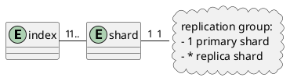

# Reading and Writing documents

## Introduction

Elasticsearch中的每个索引可以被拆分成多个分片(shard), 并且每个分片可以有多个副本.
这些副本被称为副本组(replication group), 并且当文档被添加或删除时它们必须始终保持同步.
如果我们无法保证, 那么就会导致从一个备份读取的数据和从另一个读取的数据不一致.

保持分片副本的同步以及从它们获取数据的模型称为数据备份模型(data replication model).
Elasticsearch所使用的数据备份模型是基于**主备模型(primary-backup model)**, 
详情可参考微软的研究报告[PacificA paper][].
这个模型是基于副本组中只有一个副本作为主分片, 其他的分片作为副本分片.
主分片作为所有索引操作的入口点, 负责校验操作的有效性以及保证操作的正确性.
一旦操作被住分片接受, 主分片也负责复制操作到其他的副本分片上.

本节的目的是对Elasticsearch复制模型进行高级概述，并讨论它对写入和读取操作之间的各种交互的影响。

## Basic write model

每个Elasticsearch的索引操作首先通过**[routing][]**得到一个**副本组**， 一般情况下是基于Document ID.
一旦副本组确定了, 操作会被传递给这个副本组中的主分片, 由住分片负责校验以及传递这个操作给其他副本分片.
因为副本可以离线, 主分片不需要同步到所有的副本. 
Elasticsearch维护了一个需要接受同步的分片副本的列表, 被称为**同步副本(in-sync copies)**, 它维护在主节点中.
顾名思义, 这些好的分片副本会保证在返回相应给用户之前, 所有索引以及删除操作已经在各自副本上被处理.
主分片负责维护这个规则, 并且将所有请求传递给副本组中的每一个好的分片副本.

主分片遵循以下的流程:

1. 检验进来的操作是否合法, 如果不合法就会被拒绝
2. 在当前分片执行, 并且会校验字段内容是否合法.
3. 传递操作到同步副本组中的每个副本, 如果有多个, 则并行执行
4. 一旦所有的副本成功执行, 并且响应给主分片, 主分片就成功相应发情操作的客户端.

### Failure handling

TODO

## Basic read model

TODO

## A few simple implications

TODO

## Failures

TODO

## The Tip of the Iceberg

TODO

---
[PacificA paper]: https://www.microsoft.com/en-us/research/publication/pacifica-replication-in-log-based-distributed-storage-systems/
[routing]: https://www.elastic.co/guide/en/elasticsearch/reference/current/docs-index_.html#index-routing